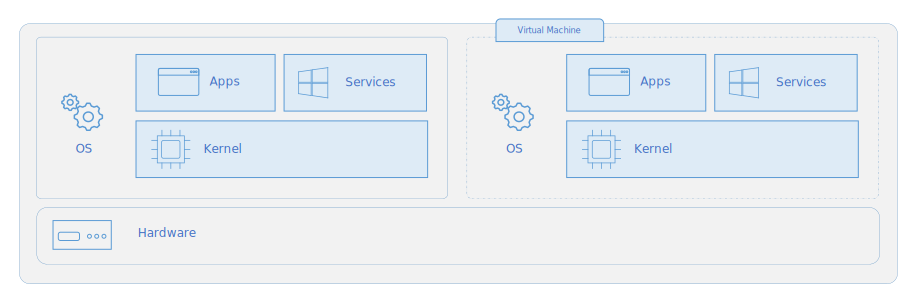

# Containers e docker

---

## Container vs máquina virtual
<!-- _class: img -->



<!-- _footer: Fonte: https://learn.microsoft.com/en-us/virtualization/windowscontainers/about/containers-vs-vm -->

---

## Containers, docker e OCI
- Depende do `cgroups` do kernel Linux
- Docker foi base para o Open Container Initiative
- Existem outras formas de executar containers do pradrão OCI
- Docker-compose: permite a execução de vários containers através de apenas um arquivo YAML

---

## Entre sistemas operacionais...
<!-- _class: img -->


<!-- _footer: Fonte: https://www.reddit.com/r/ProgrammerHumor/comments/14pm2mh/youknowwhoyouare/ -->

---

## Dockerfile ou Containerfile

```dockerfile
FROM ubuntu:23.04

WORKDIR /meus_arquivos

RUN apt update && \
    apt upgrade -y && \
    apt install git -y

CMD bash
```

---

## Persistencia dos dados

- Container é uma instância de uma imagem
- Imagens são imutáveis depois de criadas
- Podemos montar volumes no container

---

## O que containers resolvem?
<!-- _class: img -->


---

## Devcontainers

- VSCode
- CLion

---

## Distribuições Linux

- Fedora: CoreOS -> Atomic Desktops (Silverblue, Kinoite, etc)
- openSUSE: MicroOS -> Aeon/Kalpa
- Ubuntu: Core + Snapd
- Toolbox e Distrobox
