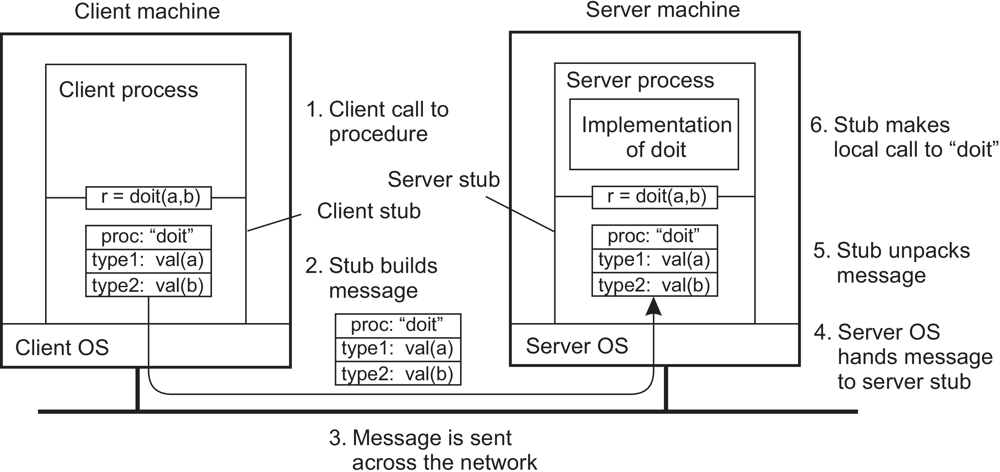

<!-- headingDivider: 2 -->

<!--
_header: CC7261 - Sistemas Distribuídos
_footer: Leonardo Anjoletto Ferreira
_paginate: skip
-->

# Remote Procedure Call e gRPC

https://grpc.io/

## Remote Procedure Call (RPC)

RPC é uma forma de um programa executar um procedure (subrotina) em outro endereço (programa executando no mesmo ou em outro local), como se estivesse executando a procedure de forma local sem que o desenvolvedor precise se preocupar com o a interação entre os programas.

## RPC - funcionamento




<!--
_footer: Figura retirada do livro base da disciplina
-->

## gRPC

> Google has been using a single general-purpose RPC infrastructure called Stubby to connect the large number of microservices running within and across our data centers for over a decade. Our internal systems have long embraced the microservice architecture gaining popularity today. Having a uniform, cross-platform RPC infrastructure has allowed for the rollout of fleet-wide improvements in efficiency, security, reliability and behavioral analysis critical to supporting the incredible growth seen in that period.

Louis Ryan (Google), 08/09/2015

## gRPC

<div class="columns">
<div>


</div>
<div>

- cliente-servidor
- cliente pede para o servidor executar uma função (procedure)
- servidor executa a função e retorna o resultado para o cliente
- modelo de troca de mensagens pode ser escolhido

</div>
</div>

## Protobuf

- normalmente usado como Interface Definition Language (IDL) para o gRPC
- dados estruturados
- extensível
- serializável
- language-neutral: pode ser usado com diversas linguagens
- platform-neutral: funciona em qualquer equipamento

## Protobuf - exemplo

Arquivo `aula.proto`
```proto
message Aula {
    int64 matricula = 1;
    string disciplina = 2;
    bool presenca = 3;
}
```

Compilação para python:
```sh
protoc --proto_path=. --python_out=. aula.proto
```

## Definição como serviço

```proto
service Servico {
    rpc Subrotina(MensagemCliente) returns (MensagemServidor) {}
}

message MensagemCliente{
    required string mensagem = 1;
}

message MensagemServidor{
    required string mensagem = 1;
}
```

## Hello world (de novo, mas em RPC)

Com cliente e servidor:
- padrão de mensagem e subrotina que será usada entre os serviços
- servidor implementa a função que será executa
- cliente conhece a função que pode ser executada

## No terminal do Codespace

```sh
pip install grpcio grpcio-tools
```

Se quiser instalar o compilador do protobuf
```sh
sudo apt update
```

```sh
sudo apt install -y protobuf-compiler
```


## Hello World - Protobuf

```proto
syntax = "proto3";

service Greeter {
    rpc HelloWorld(MsgCliente) returns (MsgServidor) {}
}

message MsgCliente {
    string mensagem = 1;
}

message MsgServidor {
    string mensagem = 1;
}
```

## Compilação do arquivo proto

```sh
python -m grpc_tools.protoc -I. --python_out=. --pyi_out=. --grpc_python_out=. helloworld.proto
```

## Código do servidor (python)

```py
from concurrent import futures
import grpc
import helloworld_pb2
import helloworld_pb2_grpc

class Greeter(helloworld_pb2_grpc.GreeterServicer):
    def HelloWorld(self, request, context):
        print(f"Mensagem do cliente: {request.mensagem}")
        return helloworld_pb2.MsgServidor( mensagem="World")

endereco = "[::]:50051"
servidor = grpc.server(futures.ThreadPoolExecutor(max_workers=1))
helloworld_pb2_grpc.add_GreeterServicer_to_server(Greeter(), servidor)

servidor.add_insecure_port(endereco)
servidor.start()
print(f"Servidor escutando em {endereco}")
servidor.wait_for_termination()
```

## Código do cliente (python)

```py
import grpc
import helloworld_pb2
import helloworld_pb2_grpc

print("Cliente conectando com servidor")

porta = "50051"
endereco = "localhost"

with grpc.insecure_channel(f"{endereco}:{porta}") as channel:
    stub = helloworld_pb2_grpc.GreeterStub(channel)
    resposta = stub.HelloWorld(helloworld_pb2.MsgCliente(mensagem="hello"))
    print(f"Resposta do servidor: {resposta.mensagem}")
```

## gRPC + Protobuf

- cliente-servidor
- cliente conhece a classe e métodos que podem ser usados, mas não conhece a implementação
- troca de mensagens usando o protobuf gerado para a linguagem
- mensagens são em formato binário
- caso ocorra algum erro no servidor, o cliente que exibe a mensagem de erro
