<!-- headingDivider: 2 -->

<!--
_header: CC7261 - Sistemas Distribuídos
_footer: Leonardo Anjoletto Ferreira
_paginate: skip
-->

# Concorrência e sincronização

## Aviso

As imagens usadas nos slides foram tiradas do livro base, que estão disponíveis no site https://www.distributed-systems.net/index.php/books/ds4/, junto com a versão grátis do livro

## Relógios

## Clock em eletrônica e drift
Considerando uma CPU com clock de 3GHz:
- $3\textrm{GHz} = 3 \times 10^9$ ciclos por segundo
- 1 ciclo de clock leva $\frac{1}{3 \times 10^9}$ segundos para executar
- Aproximando, 1 ciclo de clock ocorre a cada 0.3333...ns
- Ou seja, temos erro na aproximação da contagem de 1 segundo
* Portanto, precisamos de algo para sincronizar os relógios

## Clock em eletrônica e drift
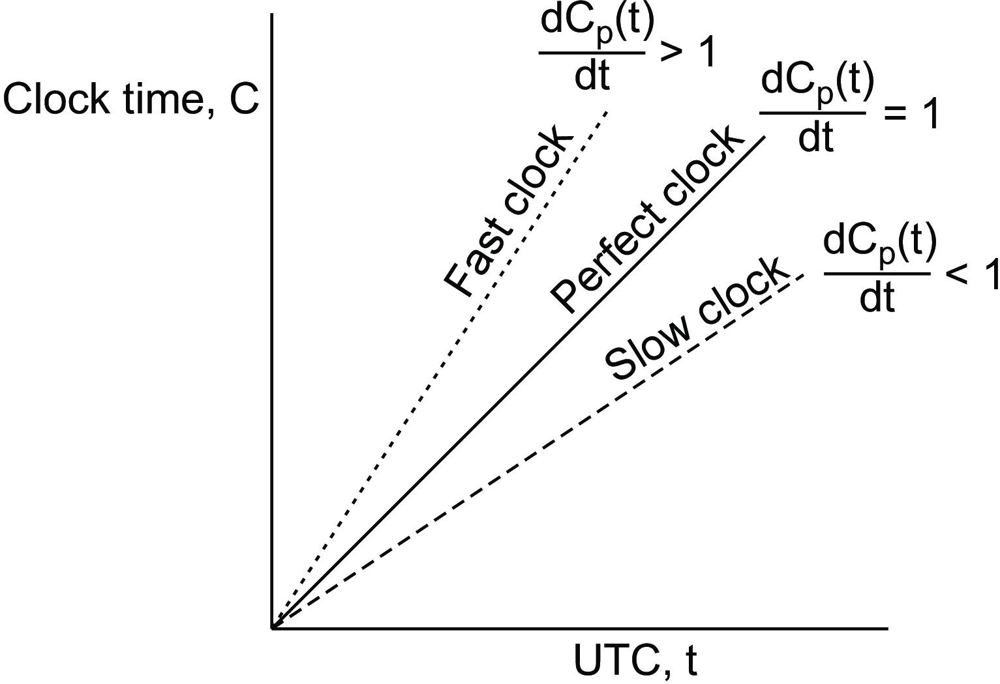

## Algoritmo de Berkley

- [Artigo está disponível](https://apps.dtic.mil/sti/pdfs/ADA619395.pdf)
- Usado no UNIX 4.3BSD
- Um daemon por computador
- O coordenador fala qual é a hora correta
- Usa a latência da mensagem para calcular o intervalo de tempo aceito
- Servidores NTP (e.g, https://ntp.br/)

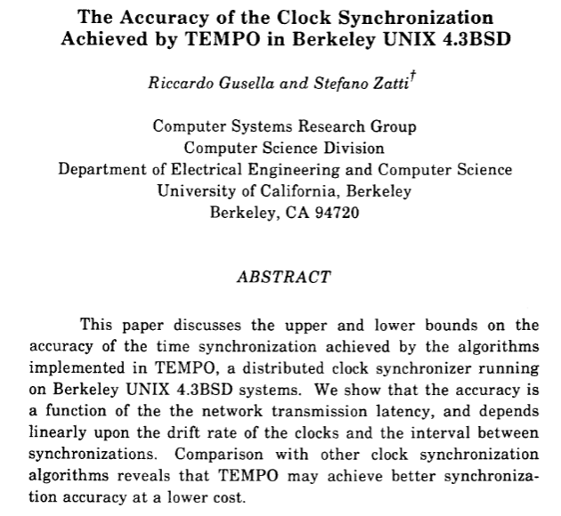

## Exclusão mútua e algoritmos de eleição
- Para sincronizar os relógios, precisamos saber quem é o coordenador
- Não podemos ter mais do que um coordenador
- O coordenador pode parar de funcionar
- E seria bom que este processo fosse feito de forma automatíca
- Algoritmos de eleição servem para escolher o coordenador

## Eleição por bullying
- Algoritmo do Valentão
- Usa o ID do processo (rank) para determinar quem é o coordenador
- O coordenador é o processo de maior rank que responde as mensagens
- Se o coordenador parar de responder, uma nova eleição é realizada

## Eleição por bullying

* O processo 7 não está mais funcionando
* O processo 4 não recebe a resposta de 7
* 4 envia uma mensagem para os de rank maior (5, 6 e 7) para eleger um novo coordenador

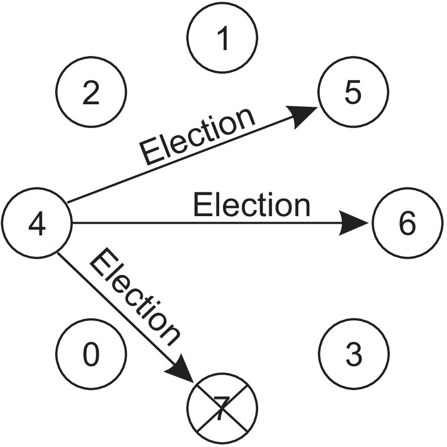

## Eleição por bullying

- O processo 7 não responde
- Os processos 5 e 6 respondem avisando que farão a eleição

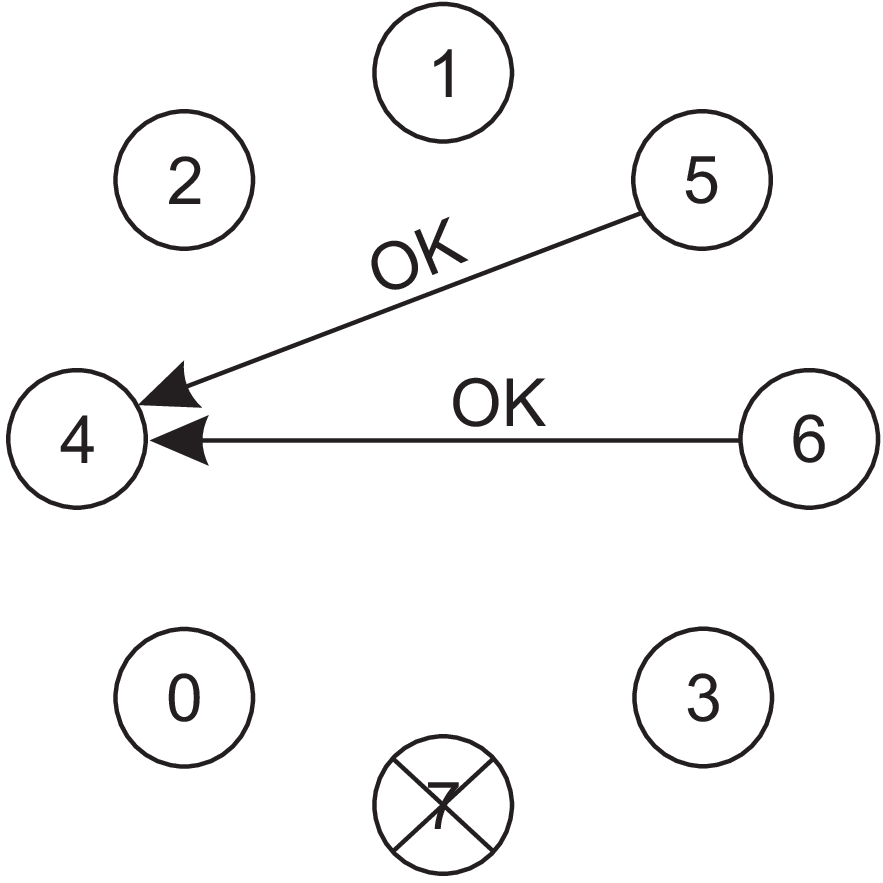

## Eleição por bullying

Todos os processos envolvidos na eleição enviam mensagens para todos os outros e esperam uma resposta para saber quem é o processo com maior rank

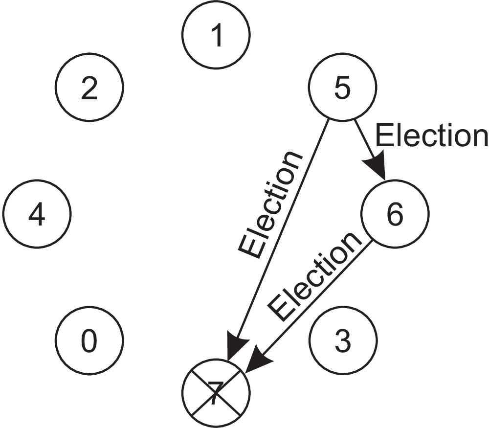

## Eleição por bullying

Como o processo 7 não respondeu, o processo 6 é eleito como coordenador, avisando o processo 5

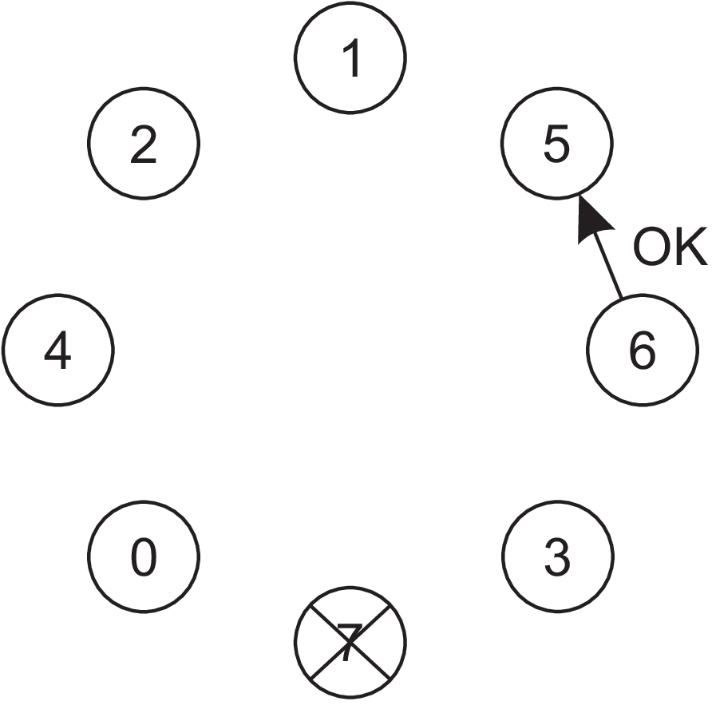

## Eleição por bullying

O processo 6 avisa todos os outros processos que a partir de agora ele responde como coordenador

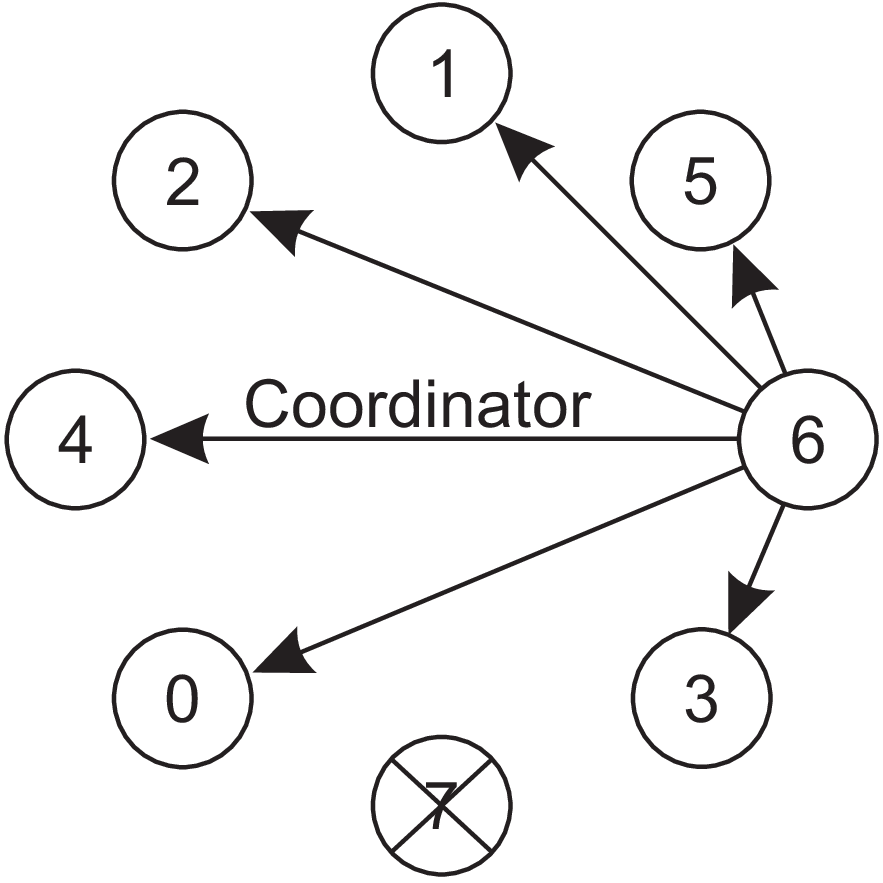

## Eleição em anel

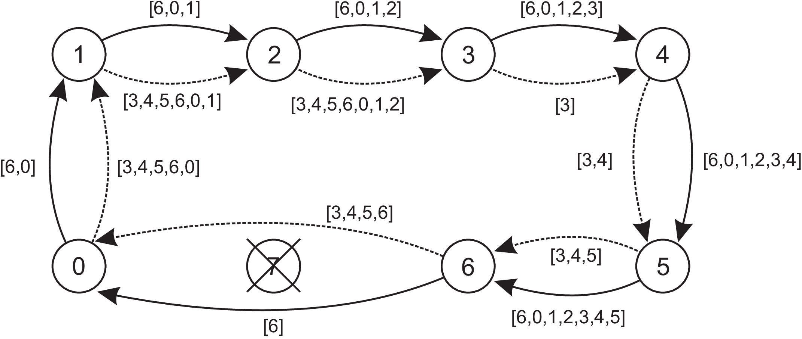

## Relógios lógicos e ordem de eventos

- [Pesquisa realizada por Leslie Lamport (mesmo do LaTeX)](https://lamport.azurewebsites.net/pubs/time-clocks.pdf)
- Propõe uma forma de sincronizar relógios a partir da troca de mensagens com timestamp
- O relógio de quem recebe a mensagem é sincronizado com o relógio de quem envia a mensagem

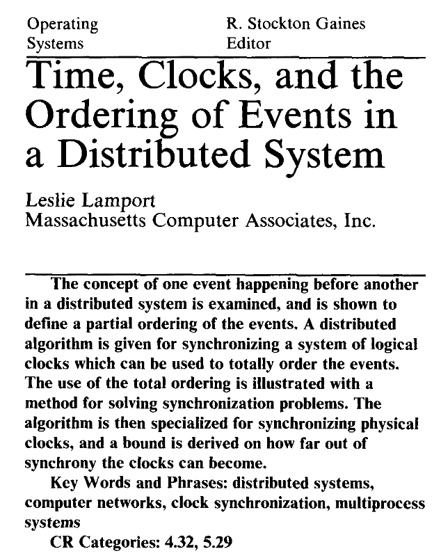

## Relógio lógico
- Não é armazenada a hora correta do relógio
- A diferença de tempo entre as mensagens é usada como referência
- Para cada mensagem trocada, é acrescentado 1 ao tempo do relógio lógico

## Relógio lógico

Relógios não atualizados

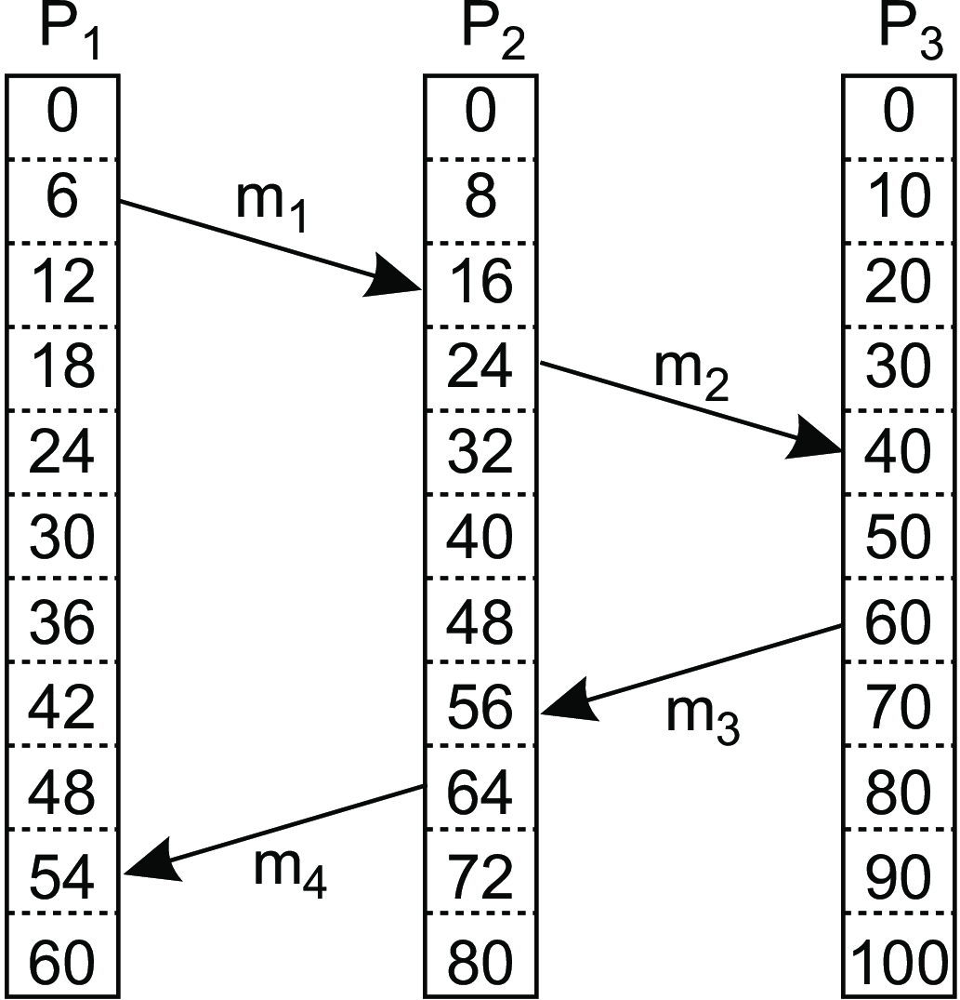

Relógios atualizados

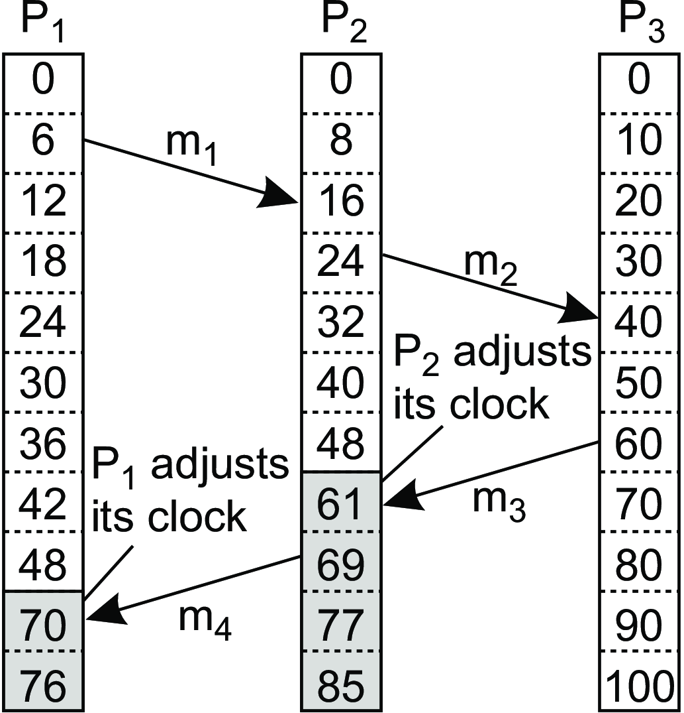

