<!-- headingDivider: 2 -->

<!--
_header: CC7261 - Sistemas Distribuídos
_footer: Leonardo Anjoletto Ferreira
_paginate: skip
-->

# Nomeação

## Aviso

As imagens usadas nos slides foram tiradas do livro base, que estão disponíveis no site https://www.distributed-systems.net/index.php/books/ds4/, junto com a versão grátis do livro

## Nomeação
- Nomes são usados para referenciar entidades em sistemas distribuídos
- Para acessar um entidade, precisamos acessa um access point
- Access points são nomeados por endereços

## Identificadores
- Um identificador é um nome com propriedades específicas:
    - Um identificador se refere a uma entidade
    - Uma entidade possui apenas um identificador
    - Um identificador se refere sempre a mesma entidade e nunca é reutilizado

- Nome puro:
    - string aleatória que não possui significado
    - podem ser usadas apenas para comparação
    - um identificador não precisa ser um nome puro

## Serviços de Localização Hierárquicos

Um Serviço de Localização Hierárquico (HLS) usa uma árvore de busca para descrever a rede com divisões hierárquicas entre os domínios, com cada domínio separado por um diretório nó.

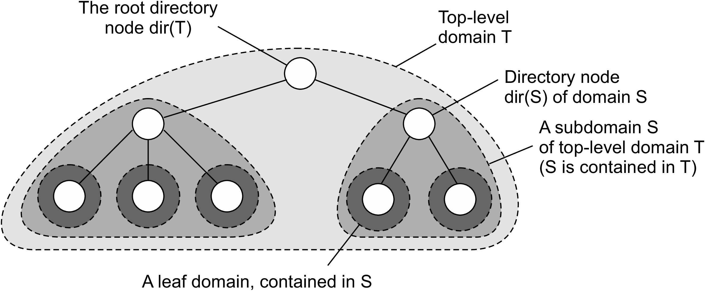

## HLS - Organização

- Endereço de uma entidade é armazenado na folha ou nó intermediário
- O nó intermediário possui um ponteiro para um filho somente se a subárvore com raiz no filho possuir o endereço da entidade
- A raiz possui informação sobre todos os nós

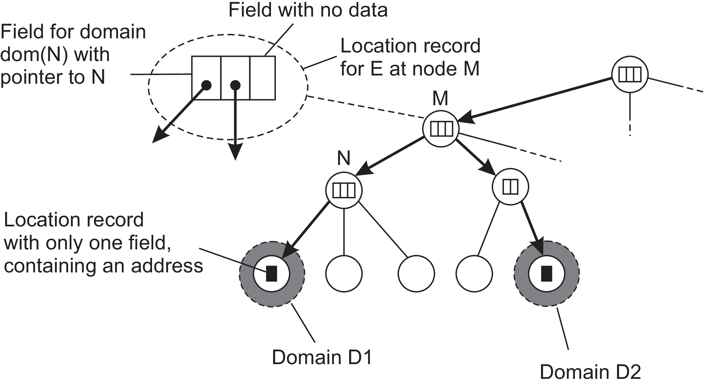

## HLS - Busca

- Busca começa na folha
- Se o nó não possui informação, procura no nó pai
- Se o nó possui informação, segue até chegar na folha
- No pior dos casos, a raiz possui a informação

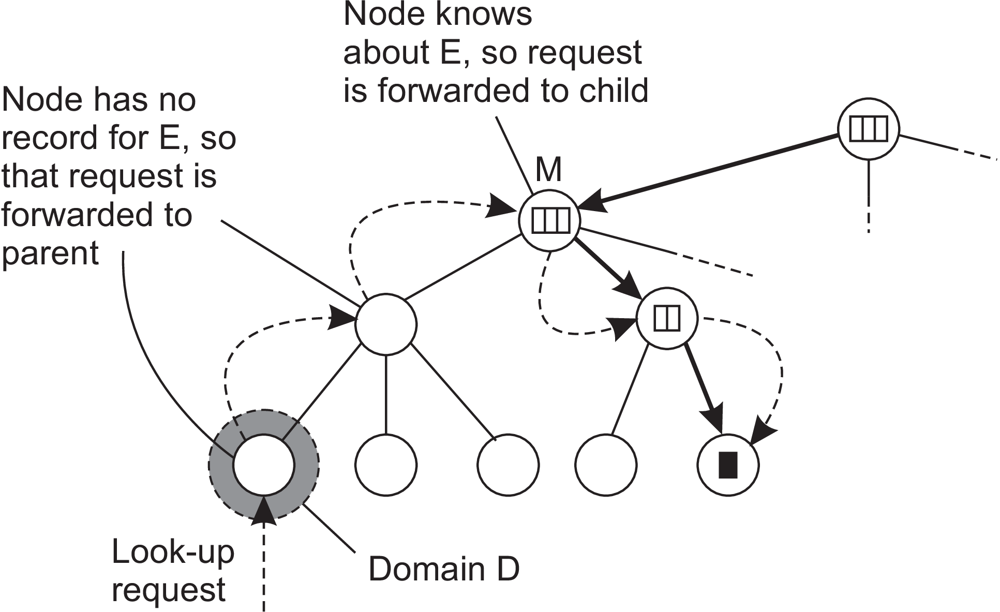

## HLS - Inserção

1. Inserção é feita no primeiro nó que possui informação sobre a entidade

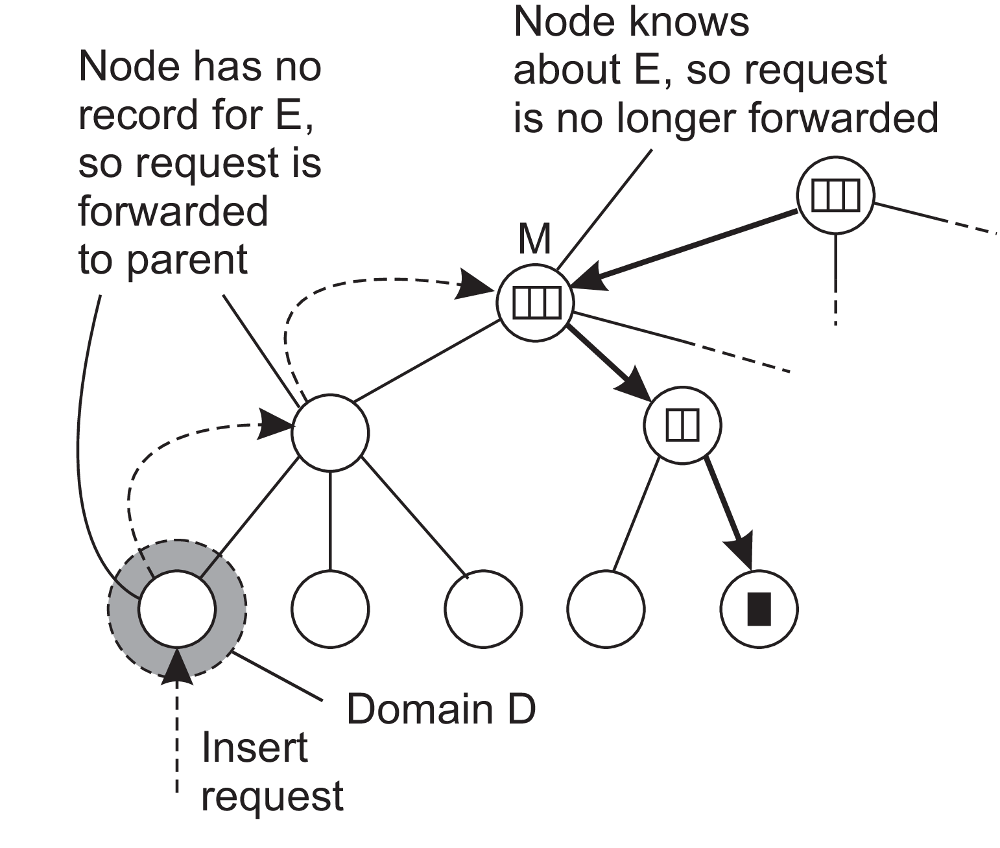

2. É criado um conjunto de ponteiros que chegam até a folha

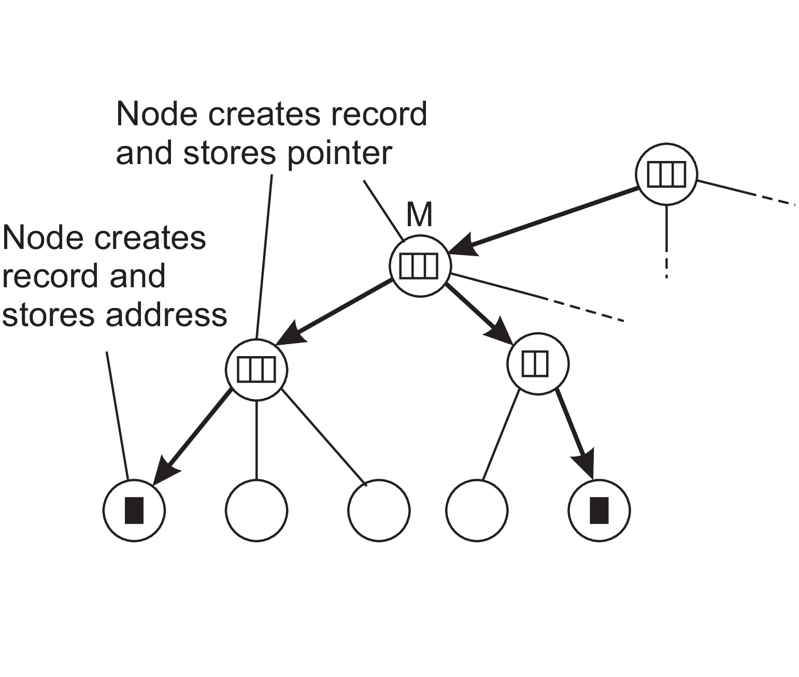

## Para fazer tudo isso escalar

- Separação entre projeto lógico e implementação física
- Diferentes servidores físicos para servidores lógicos de nomes
- Mapeamento de entidades para servidores físicos para distribuir os registros

- Assumindo $N$ hosts físicos $\{H_1, H_2, \ldots, H_N\}$ que podem executar um ou mais serviços de localização

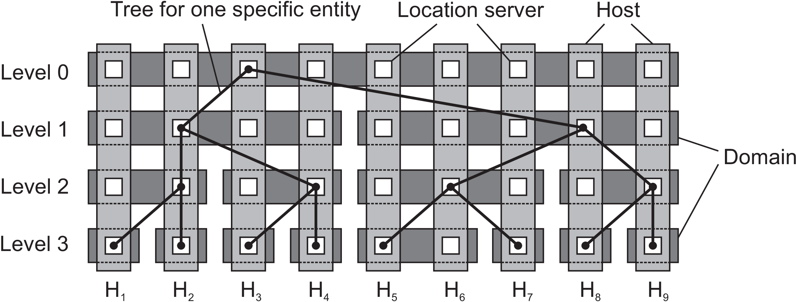

## Name space

- Grafo de nomes possui as folhas representando entidades com nomes
- Um nó de diretório é uma entidade que referencia os outros nós
- Hard link: path name, resolvido seguindo um caminho no grafo
- Soft link: um nó $n$ possui o nome de outro nó

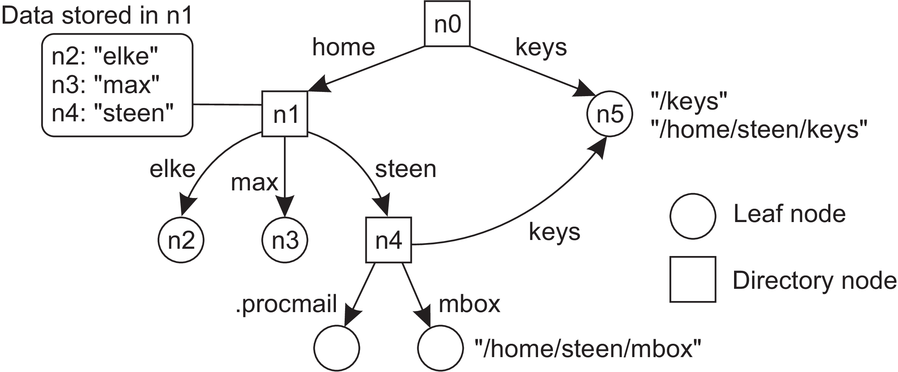

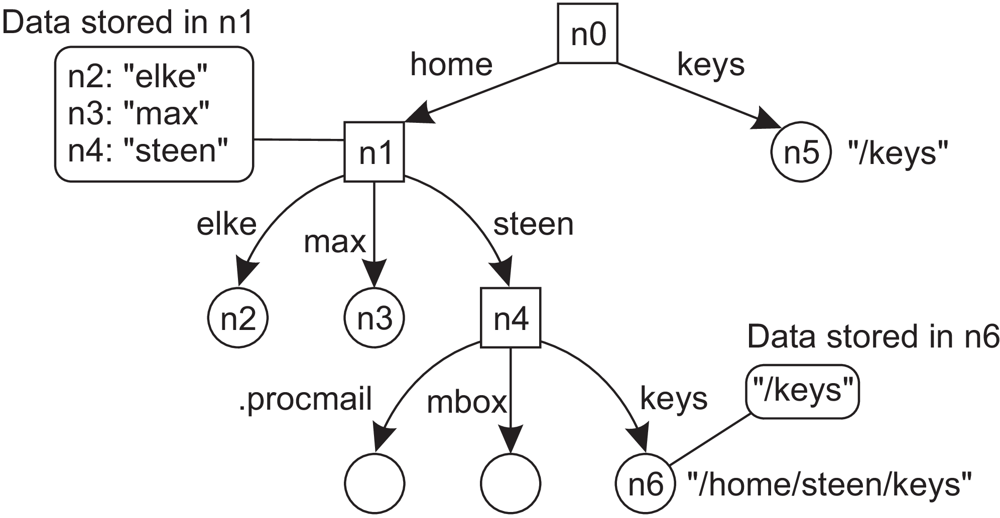

## Implementação
- Distribui a resolução de nomes e o gerenciamento de name space em vários servidores, distribuindo os nós do grafo de nomeação
- Separa em 3 níveis:
1. Global: nós de diretório de nível mais alto que são gerenciados por diferentes administradores
2. Administrativo: nós de diretório de nível médio que são agrupados para serem separados por administrador
3. Gerencial: nós de diretórios de nível baixo com apenas um administrador com o problema de mapear diretórios locais aos servidores de nomes

## Implementação (DNS)
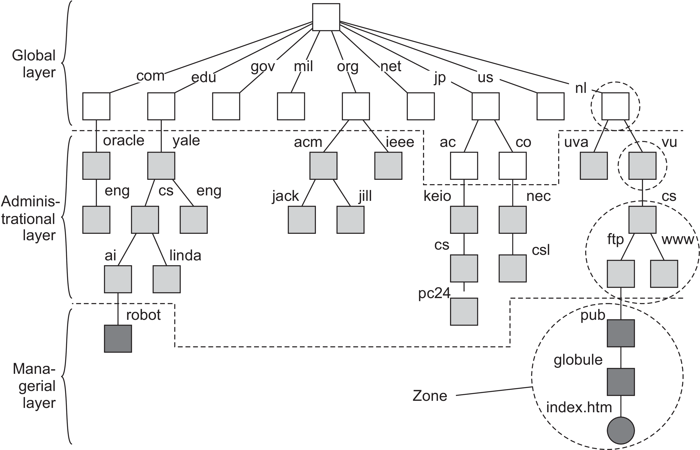

## DNS

- Organização hierárquica de nomes em que cada nó possui apenas uma aresta de entrada
- Domínio é uma subárvore
- Nome do domínio é o path name até a raiz do domínio

DNS tradicional
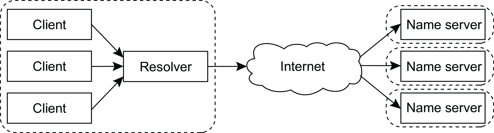

DNS atual
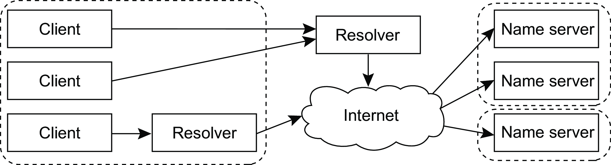

