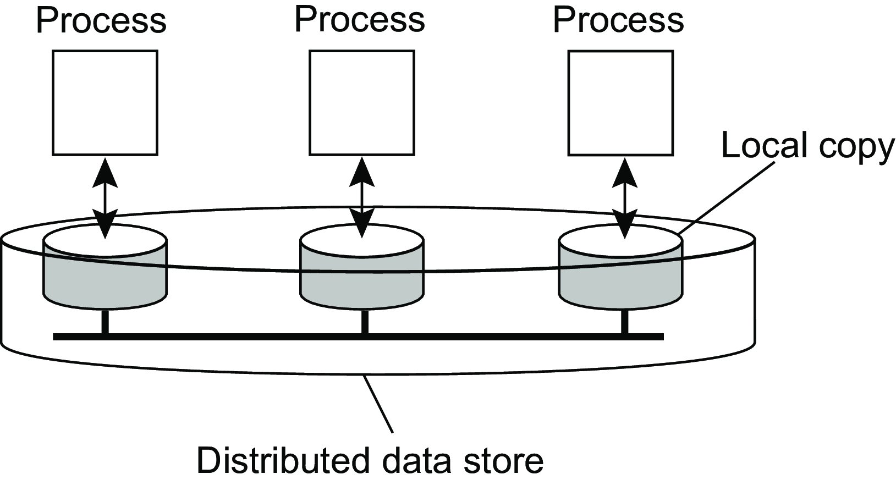

<!-- headingDivider: 2 -->

<!--
_header: CC7261 - Sistemas Distribuídos
_footer: Leonardo Anjoletto Ferreira
_paginate: skip
-->

# Consistência e replicação

## Aviso

Assim como na semana passada, imagens usadas nos slides foram tiradas do livro base, que estão disponíveis no site https://www.distributed-systems.net/index.php/books/ds4/, junto com a versão grátis do livro

## Réplicas
- Problema: o que fazer quando a única cópia do dado ou serviço for perdida?
- Ter réplicas permite:
    - aumentar a robustez com uma réplica assumindo o lugar de outra que deixa de estar disponível
    - melhoria de desempenho a partir do balanceamento de carga entre as réplicas
- Problema de não ter réplicas: consistência dos dados/funcionalidades

## Operações conflitantes:
- Assim como vimos em CC6240 sobre transações:
    - Leitura e escrita acontecem ao mesmo tempo
    - Escrita e escrita acontecem ao mesmo tempo
- Garantir consistência pela ordem das operações é custoso
- Podemos relaxar a necessidade de consistência para tentar permitir que os dados sejam sincronizados
- Evitar a sincronização global

## Modelo de consistência centralizado em dados

- Um data store é uma coleção de storages distribuídos
- O modelo de consistência é a forma como um data store especifica o resultado de operações de leitura e escrita quando temos concorrência

## Tipos de consistência:
- Sequencial: o resultado de qualquer execução é o mesmo que se todos os processos fossem executados um ordem
- Linearização: cada operação parece que foi executada de forma instantânea em algum momento entre o início e o fim de sua execução
- Consistência causal: escritas que podem ter relações causais entre processos deve ser vistar na mesma ordem entre processos

## Consistência
- Não nos importamos se operações de leituras e escrita são retornadas aos processos de forma imediata
- Apenas queremos que o resultado das operações em séries seja conhecido
- Consistência de entrada:
    - Acessos a travas (locks) são sequenciais
    - Não é permitido acessar uma trava até que todas as escritas tenham sido realizadas
    - Nenhum acesso a dados é permitido até que todas as travas tenham sido acessadas

## Consistência eventual
Considerando
    - Coleção de data stores
    - Operações de escritas que podem ser concorrentes

Os data stores são eventualmente consistentes se:
    - Não existem atualizações (escritas) após certo tempo
    - Todas as atualizações foram propagadas em todas as réplicas

## Consistência eventual forte
Em caso de atualizações conflitantes, possuir um mecanismo de resolução de conflito para determinar qual atualização usar (e.g., usar o relógio e aceitar a atualização mais recente)

## Consistência centrada no cliente
Um cliente que conecta a mesma fonte de dados (e.g., banco de dados distribuído) deseja que os dados lidos e escritos em uma fonte sejam iguais ao de outra

## Consistência centrada no cliente
- Leitura monotônica: se um processo ler dados de um item $i$, é esperado que as leituras seguintes do item $i$ retornem os mesmos dados ou mais recentes
- Escrita monotônica: a escrita em um item $i$ é completado antes da execução de qualquer operação de escrita seguinte no mesmo item $i$

## Consistência centrada no cliente
- Leitura de um dado escrito: a escrita em um item $i$ garante que em sequência será realizada uma operação de leitura em $i$ (e.g., leitura de dado em cache)
- Escrita depois da leitura: uma escrita em um item $i$ após a leitura do item $i$ garante que a atualização será realizada nos dados lidos anteriormente (e.g., atualização de comentários em redes sociais)

## Distribuição de conteúdo
Considerando cliente-servidor:
1. Propagação apenas da notificação/invalidação da atualização (e.g., cache)
2. Réplica passiva: cópia de dados entre as réplicas (e.g., banco de dados distribuídos)
3. Réplica ativa: propagação da operação de atualização entre as réplicas

## Distribuição de conteúdo
Formas de atualização dos dados:
- Atualização por push: iniciado pelo servidor e o cliente aceita a propagação dos dados
- Atualização por pull: iniciado pelo cliente, que pede ao servidor pelas atualizações

## Alternativas para cache e réplicas
- Servidores e edge computing
- Edge possui uma cópia do banco de dados do servidor
- Cache content-aware: verifica se uma requisição pode ser respondida com o cache local, mas depende do servidor saber os dados que edge possui local
- Cace content-blind: armazena a query e o resultado. Quando a mesma query for executada, o mesmo resultado é retornado

## Alternativas para cache e réplicas

